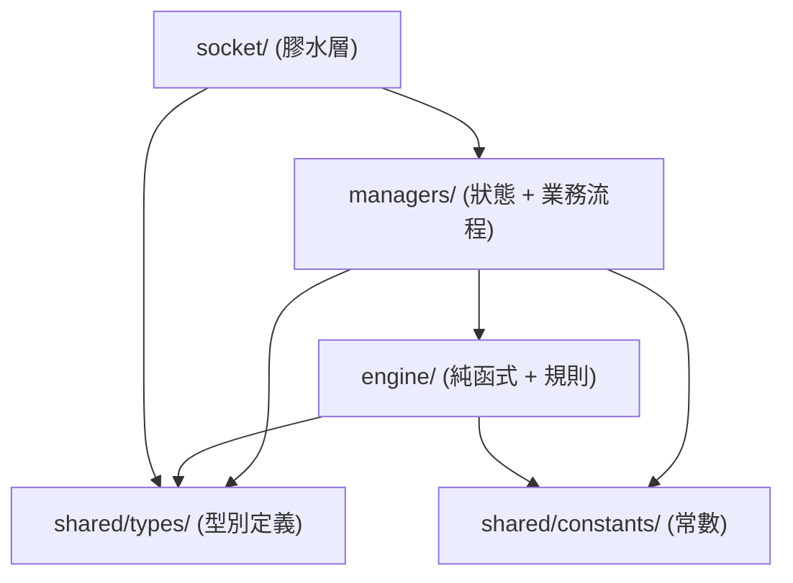
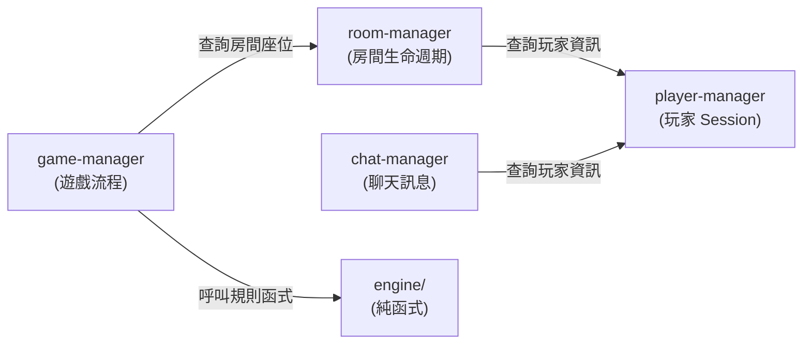
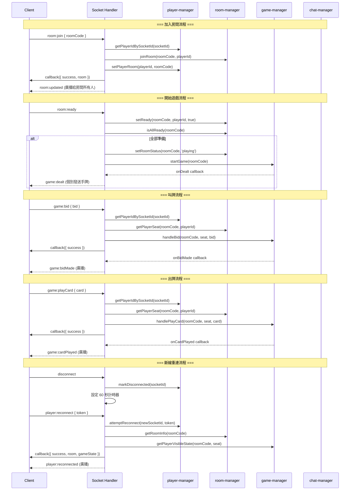

# Bridge Online — 詳細設計文件 (Detailed Design)

> **文件版本**: v1.0  
> **建立日期**: 2026-07-18  
> **輸入來源**: [proposal.md](file:///c:/Users/ben91/Desktop/Bridge_Online/docs/proposal.md)

---

## 1. 設計原則與範圍

### 1.1 設計範圍

本文件涵蓋 **shared 層**（共用型別與常數）與**後端**（server）的詳細設計。前端（client）不在本文件設計範圍內。

### 1.2 設計風格

- **純函式 / 模組化設計**：不使用 Class，以模組（module）為邊界確保獨立性
- **模組間透過明確的函式介面通訊**，不共享可變狀態
- **Engine 層為純函式**：輸入→輸出，無副作用，便於獨立測試
- **Manager 層管理狀態**：維護記憶體中的 Map/Object，透過函式對外暴露操作介面
- **Socket 層為膠水層**：僅負責事件路由與 payload 轉換，不含業務邏輯

### 1.3 模組依賴規則



**禁止方向**：

- ❌ Engine 不得依賴 Manager 或 Socket
- ❌ Manager 不得依賴 Socket
- ❌ 任何模組不得反向依賴上層

---

## 2. Shared 層：型別定義 (shared/src/types/)

### 2.1 player.ts — 玩家型別

```typescript
/** 玩家唯一識別碼（由伺服器生成） */
type PlayerId = string;

/** 重連用 token */
type ReconnectToken = string;

/** 座位方位 */
type Seat = 'N' | 'E' | 'S' | 'W';

/** 玩家代表顏色（十六進制色碼） */
type PlayerColor = string;

/** 玩家資訊 */
interface PlayerInfo {
  id: PlayerId;
  nickname: string;
  color: PlayerColor;
}

/** 玩家連線狀態 */
type ConnectionStatus = 'connected' | 'disconnected';
```

### 2.2 room.ts — 房間型別

```typescript
/** 房間代碼（6 碼英數字） */
type RoomCode = string;

/** 遊戲類型 */
type GameType = 'bridge';

/** 房間狀態 */
type RoomStatus = 'waiting' | 'playing';

/** 座位資訊 */
interface SeatInfo {
  player: PlayerInfo | null;
  isReady: boolean;
}

/** 座位表：四個方位的座位狀態 */
type SeatMap = Record<Seat, SeatInfo>;

/** 房間資訊（對外暴露） */
interface RoomInfo {
  code: RoomCode;
  gameType: GameType;
  status: RoomStatus;
  seats: SeatMap;
  createdAt: number;
}
```

### 2.3 game.ts — 遊戲型別

```typescript
/** 花色 */
type Suit = 'clubs' | 'diamonds' | 'hearts' | 'spades';

/** 叫牌花色（含 NT） */
type BidSuit = Suit | 'nt';

/** 牌面數字 */
type Rank = 2 | 3 | 4 | 5 | 6 | 7 | 8 | 9 | 10 | 11 | 12 | 13 | 14;
// 11=J, 12=Q, 13=K, 14=A

/** 一張牌 */
interface Card {
  suit: Suit;
  rank: Rank;
}

/** 叫牌等級（1-7） */
type BidLevel = 1 | 2 | 3 | 4 | 5 | 6 | 7;

/** 叫牌動作 */
type BidAction =
  | { type: 'bid'; level: BidLevel; suit: BidSuit }
  | { type: 'pass' };

/** 合約（叫牌結束後確定） */
interface Contract {
  level: BidLevel;
  suit: BidSuit;
  declarer: Seat;
}

/** 遊戲階段 */
type GamePhase =
  | 'dealing'
  | 'redeal_pending'
  | 'bidding'
  | 'playing'
  | 'scoring';

/** 一墩的記錄 */
interface TrickRecord {
  cards: Record<Seat, Card>;
  leadSeat: Seat;
  winnerSeat: Seat;
}

/** 遊戲動作日誌項目 */
type GameLogEntry =
  | { type: 'bid'; seat: Seat; action: BidAction; timestamp: number }
  | { type: 'play'; seat: Seat; card: Card; timestamp: number }
  | { type: 'trick_end'; winnerSeat: Seat; trickIndex: number; timestamp: number }
  | { type: 'redeal'; seat: Seat; accepted: boolean; timestamp: number }
  | { type: 'system'; message: string; timestamp: number };

/** 遊戲結算結果 */
interface GameResult {
  contract: Contract;
  declarerTeamTricks: number;
  defenderTeamTricks: number;
  requiredTricks: number;    // 6 + contract.level
  declarerTeamWins: boolean;
}

/** 隊伍劃分：東西 vs 南北 */
type Team = 'EW' | 'NS';

/** 出牌階段狀態 */
interface PlayingState {
  currentTrick: Partial<Record<Seat, Card>>;
  trickLeadSeat: Seat;
  currentTurnSeat: Seat;
  completedTricks: TrickRecord[];
  trickCountEW: number;
  trickCountNS: number;
}

/** 叫牌階段狀態 */
interface BiddingState {
  bids: Array<{ seat: Seat; action: BidAction }>;
  currentBidderSeat: Seat;
  highestBid: { level: BidLevel; suit: BidSuit; seat: Seat } | null;
  consecutivePassCount: number;
  isFirstRound: boolean;
}

/** 完整遊戲狀態（伺服器內部） */
interface GameState {
  roomCode: RoomCode;
  phase: GamePhase;
  hands: Record<Seat, Card[]>;
  dealerSeat: Seat;              // 隨機指定的叫牌起始玩家
  bidding: BiddingState | null;
  contract: Contract | null;
  playing: PlayingState | null;
  result: GameResult | null;
  log: GameLogEntry[];
  redealPendingSeat: Seat | null; // 等待倒牌重洗回應的玩家
}

/** 給特定玩家的可見遊戲狀態（隱藏他人手牌） */
interface PlayerVisibleGameState {
  phase: GamePhase;
  myHand: Card[];
  mySeat: Seat;
  dealerSeat: Seat;
  bidding: BiddingState | null;
  contract: Contract | null;
  playing: PlayingState | null;
  result: GameResult | null;
  log: GameLogEntry[];
  redealPendingSeat: Seat | null;
}
```

### 2.4 chat.ts — 聊天型別

```typescript
/** 聊天訊息 */
interface ChatMessage {
  id: string;
  sender: PlayerInfo;
  content: string;
  timestamp: number;
}
```

### 2.5 socket-events.ts — Socket 事件定義

```typescript
// ─── Client → Server 事件 ───

interface ClientToServerEvents {
  'player:setNickname': (
    payload: { nickname: string; color: PlayerColor },
    callback: (response: { success: boolean; error?: string; playerId?: PlayerId; reconnectToken?: ReconnectToken }) => void
  ) => void;

  'room:create': (
    payload: { gameType: GameType },
    callback: (response: { success: boolean; error?: string; roomCode?: RoomCode }) => void
  ) => void;

  'room:join': (
    payload: { roomCode: RoomCode },
    callback: (response: { success: boolean; error?: string; room?: RoomInfo }) => void
  ) => void;

  'room:leave': (
    callback: (response: { success: boolean; error?: string }) => void
  ) => void;

  'room:changeSeat': (
    payload: { seat: Seat },
    callback: (response: { success: boolean; error?: string }) => void
  ) => void;

  'room:ready': (
    callback: (response: { success: boolean; error?: string }) => void
  ) => void;

  'room:unready': (
    callback: (response: { success: boolean; error?: string }) => void
  ) => void;

  'game:redealResponse': (
    payload: { accept: boolean },
    callback: (response: { success: boolean; error?: string }) => void
  ) => void;

  'game:bid': (
    payload: { bid: BidAction },
    callback: (response: { success: boolean; error?: string }) => void
  ) => void;

  'game:playCard': (
    payload: { card: Card },
    callback: (response: { success: boolean; error?: string }) => void
  ) => void;

  'game:continue': (
    callback: (response: { success: boolean; error?: string }) => void
  ) => void;

  'chat:send': (
    payload: { message: string },
    callback: (response: { success: boolean; error?: string }) => void
  ) => void;

  'player:reconnect': (
    payload: { token: ReconnectToken },
    callback: (response: {
      success: boolean;
      error?: string;
      room?: RoomInfo;
      gameState?: PlayerVisibleGameState;
    }) => void
  ) => void;
}

// ─── Server → Client 事件 ───

interface ServerToClientEvents {
  'room:updated':       (payload: { room: RoomInfo }) => void;
  'room:playerLeft':    (payload: { playerId: PlayerId; seat: Seat }) => void;

  'game:started':       (payload: { gameState: PlayerVisibleGameState }) => void;
  'game:dealt':         (payload: { hand: Card[] }) => void;
  'game:redealAvailable': (payload: { seat: Seat }) => void;
  'game:redealt':       (payload: { hand: Card[] }) => void;
  'game:biddingStart':  (payload: { startSeat: Seat }) => void;
  'game:bidMade':       (payload: { seat: Seat; action: BidAction }) => void;
  'game:biddingEnd':    (payload: { contract: Contract }) => void;
  'game:turnStart':     (payload: { seat: Seat; validCards?: Card[] }) => void;
  'game:cardPlayed':    (payload: { seat: Seat; card: Card }) => void;
  'game:trickEnd':      (payload: { winner: Seat; cards: Record<Seat, Card>; trickCountEW: number; trickCountNS: number }) => void;
  'game:ended':         (payload: { result: GameResult }) => void;
  'game:aborted':       (payload: { reason: string }) => void;
  'game:logEntry':      (payload: { entry: GameLogEntry }) => void;

  'chat:received':      (payload: { message: ChatMessage }) => void;

  'player:disconnected': (payload: { seat: Seat }) => void;
  'player:reconnected':  (payload: { seat: Seat }) => void;
}
```

---

## 3. Shared 層：常數定義 (shared/src/constants/)

### 3.1 cards.ts — 牌組常數

```typescript
/** 花色顯示順序（手牌排序用）：黑桃、紅心、梅花、方塊 */
const SUIT_DISPLAY_ORDER: readonly Suit[] = ['spades', 'hearts', 'clubs', 'diamonds'];

/** 牌面數字排序（由大到小）：A, K, Q, J, 10, 9, ..., 2 */
const RANK_ORDER_DESC: readonly Rank[] = [14, 13, 12, 11, 10, 9, 8, 7, 6, 5, 4, 3, 2];

/** 花色 Unicode 符號 */
const SUIT_SYMBOLS: Record<Suit, string> = {
  spades: '♠',
  hearts: '♥',
  clubs: '♣',
  diamonds: '♦',
};

/** 牌面數字顯示文字 */
const RANK_DISPLAY: Record<Rank, string> = {
  14: 'A', 13: 'K', 12: 'Q', 11: 'J',
  10: '10', 9: '9', 8: '8', 7: '7',
  6: '6', 5: '5', 4: '4', 3: '3', 2: '2',
};

/** 高牌點數（HCP）：A=4, K=3, Q=2, J=1，其餘=0 */
const HIGH_CARD_POINTS: Record<Rank, number> = {
  14: 4, 13: 3, 12: 2, 11: 1,
  10: 0, 9: 0, 8: 0, 7: 0,
  6: 0, 5: 0, 4: 0, 3: 0, 2: 0,
};
```

### 3.2 game-rules.ts — 遊戲規則常數

```typescript
/** 每位玩家的手牌數量 */
const HAND_SIZE = 13;

/** 每局總墩數 */
const TOTAL_TRICKS = 13;

/** 合約基礎墩數 */
const CONTRACT_BASE_TRICKS = 6;

/** 座位順時鐘順序 */
const SEAT_ORDER_CLOCKWISE: readonly Seat[] = ['N', 'E', 'S', 'W'];

/** 隊伍劃分 */
const TEAM_SEATS: Record<Team, readonly [Seat, Seat]> = {
  EW: ['E', 'W'],
  NS: ['N', 'S'],
};

/** 叫牌花色大小順序（小到大） */
const BID_SUIT_ORDER: readonly BidSuit[] = ['clubs', 'diamonds', 'hearts', 'spades', 'nt'];

/** 倒牌重洗條件：無 A 且總點數 ≤ 此值 */
const REDEAL_MAX_POINTS = 4;

/** 斷線重連超時（毫秒） */
const RECONNECT_TIMEOUT_MS = 60_000;

/** 房間代碼長度 */
const ROOM_CODE_LENGTH = 6;
```

---

## 4. Engine 層：遊戲引擎 (server/src/engine/)

Engine 層的所有模組皆為**純函式**，不持有狀態，不產生副作用，僅依賴 shared 型別與常數。

### 4.1 deck.ts — 牌組生成與洗牌

**職責**：生成 52 張標準撲克牌、洗牌（Fisher-Yates 演算法）。

```typescript
// ─── 匯出函式 ───

/**
 * 生成一副完整的 52 張撲克牌（未洗牌，固定順序）
 * @returns Card[52]
 */
function createDeck(): Card[];

/**
 * 將牌組隨機洗牌（Fisher-Yates）
 * @param deck - 輸入牌組（不修改原陣列）
 * @returns 洗好的新陣列
 */
function shuffleDeck(deck: Card[]): Card[];
```

**設計備註**：

- `createDeck` 總是回傳相同順序，洗牌由 `shuffleDeck` 負責
- `shuffleDeck` 不修改原陣列，回傳新陣列（純函式）
- 可接受可選的 `randomFn` 參數以便測試注入確定性隨機

### 4.2 dealing.ts — 發牌與倒牌重洗

**職責**：將洗好的牌組分發給 4 位玩家、手牌排序、倒牌重洗資格判定。

```typescript
// ─── 匯出函式 ───

/**
 * 將 52 張牌分發給四位玩家
 * @param deck - 已洗好的 52 張牌
 * @returns 四個座位對應的手牌（每人 13 張，已排序）
 */
function dealCards(deck: Card[]): Record<Seat, Card[]>;

/**
 * 將手牌按照花色與數字排序
 * 花色順序：黑桃 → 紅心 → 梅花 → 方塊
 * 同花色內：A → K → Q → J → 10 → ... → 2
 * @param hand - 未排序的手牌
 * @returns 排序後的手牌（新陣列）
 */
function sortHand(hand: Card[]): Card[];

/**
 * 判定玩家是否符合倒牌重洗條件
 * 條件：手牌中不含任何 A，且總高牌點數 ≤ 4
 * @param hand - 玩家手牌
 * @returns true = 符合倒牌重洗條件
 */
function isRedealEligible(hand: Card[]): boolean;

/**
 * 計算手牌的總高牌點數（HCP）
 * A=4, K=3, Q=2, J=1，其餘=0
 * @param hand - 玩家手牌
 * @returns 總點數
 */
function calculateHandPoints(hand: Card[]): number;

/**
 * 檢查所有玩家手牌，找出第一個符合倒牌重洗條件的座位
 * 按照 SEAT_ORDER_CLOCKWISE 從叫牌起始玩家開始檢查
 * @param hands - 四位玩家的手牌
 * @param startSeat - 開始檢查的座位
 * @returns 符合條件的座位，若無人符合則為 null
 */
function findRedealEligibleSeat(
  hands: Record<Seat, Card[]>,
  startSeat: Seat
): Seat | null;
```

### 4.3 bidding.ts — 叫牌規則引擎

**職責**：叫牌合法性驗證、生成合法叫牌選項、判定叫牌階段結束條件、決定莊家與合約。

```typescript
// ─── 匯出函式 ───

/**
 * 建立初始叫牌狀態
 * @param startSeat - 叫牌起始座位
 * @returns BiddingState 初始狀態
 */
function createBiddingState(startSeat: Seat): BiddingState;

/**
 * 比較兩個叫牌的大小
 * 先比數字，再比花色
 * @returns 正數表示 a > b，負數表示 a < b，0 表示相等
 */
function compareBids(
  a: { level: BidLevel; suit: BidSuit },
  b: { level: BidLevel; suit: BidSuit }
): number;

/**
 * 取得當前合法的叫牌選項
 * 包含所有大於目前最高叫牌的選項 + pass
 * @param state - 當前叫牌狀態
 * @returns 所有合法的 BidAction 陣列
 */
function getValidBids(state: BiddingState): BidAction[];

/**
 * 驗證一個叫牌動作是否合法
 * @param state - 當前叫牌狀態
 * @param seat - 叫牌的座位
 * @param action - 叫牌動作
 * @returns { valid: true } 或 { valid: false, reason: string }
 */
function validateBid(
  state: BiddingState,
  seat: Seat,
  action: BidAction
): { valid: true } | { valid: false; reason: string };

/**
 * 套用一個叫牌動作，回傳更新後的叫牌狀態
 * @param state - 當前叫牌狀態
 * @param seat - 叫牌的座位
 * @param action - 已驗證合法的叫牌動作
 * @returns 更新後的 BiddingState（新物件）
 */
function applyBid(
  state: BiddingState,
  seat: Seat,
  action: BidAction
): BiddingState;

/**
 * 判定叫牌是否結束
 * @param state - 當前叫牌狀態
 * @returns 結果物件
 */
function checkBiddingEnd(state: BiddingState): 
  | { ended: false }
  | { ended: true; result: 'contract'; contract: Contract }
  | { ended: true; result: 'all_pass' };

/**
 * 取得下一個叫牌者的座位（順時鐘）
 * @param currentSeat - 當前座位
 * @returns 下一個座位
 */
function getNextSeat(currentSeat: Seat): Seat;
```

**叫牌結束條件邏輯**：

```
if (首輪 && 連續 pass 數 === 4):
    結果 = all_pass（重新發牌）

if (最高叫牌存在 && 連續 pass 數 === 3):
    結果 = contract（確定莊家與合約）
```

### 4.4 playing.ts — 出牌規則引擎

**職責**：出牌合法性驗證、跟牌規則、墩贏家判定、取得合法出牌。

```typescript
// ─── 匯出函式 ───

/**
 * 建立初始出牌狀態
 * @param contract - 合約
 * @returns PlayingState 初始狀態
 *
 * 首墩由莊家逆時鐘第一位開始出牌
 */
function createPlayingState(contract: Contract): PlayingState;

/**
 * 取得玩家在當前墩可出的合法牌
 * 規則：必須跟主花色（該墩第一張牌的花色），手中無主花色時可出任意牌
 * @param hand - 玩家手牌
 * @param currentTrick - 當前墩已出的牌
 * @param trickLeadSeat - 該墩首位出牌者
 * @returns 可出的牌陣列
 */
function getValidPlays(
  hand: Card[],
  currentTrick: Partial<Record<Seat, Card>>,
  trickLeadSeat: Seat
): Card[];

/**
 * 驗證一張出牌是否合法
 * @param hand - 玩家手牌
 * @param card - 要出的牌
 * @param state - 當前出牌狀態
 * @param seat - 出牌者座位
 * @returns { valid: true } 或 { valid: false, reason: string }
 */
function validatePlay(
  hand: Card[],
  card: Card,
  state: PlayingState,
  seat: Seat
): { valid: true } | { valid: false; reason: string };

/**
 * 套用一張出牌，回傳更新後的出牌狀態
 * 若該墩 4 張牌已出完，自動結算墩贏家
 * @param state - 當前出牌狀態
 * @param seat - 出牌者座位
 * @param card - 已驗證合法的牌
 * @param trumpSuit - 王牌花色（NT 時為 null）
 * @returns { state: PlayingState, trickCompleted: boolean, trickResult?: TrickRecord }
 */
function applyPlay(
  state: PlayingState,
  seat: Seat,
  card: Card,
  trumpSuit: Suit | null
): {
  state: PlayingState;
  trickCompleted: boolean;
  trickResult?: TrickRecord;
};

/**
 * 判定一墩中四張牌的贏家
 * 比較規則：王牌花色 > 主花色 > 其他花色；同花色比數字
 * @param trick - 四張牌（完整的一墩）
 * @param leadSeat - 該墩首位出牌者（決定主花色）
 * @param trumpSuit - 王牌花色（null = NT，無王牌）
 * @returns 贏家座位
 */
function determineTrickWinner(
  trick: Record<Seat, Card>,
  leadSeat: Seat,
  trumpSuit: Suit | null
): Seat;

/**
 * 比較兩張牌在指定情境下的大小
 * @param a - 牌 A
 * @param b - 牌 B
 * @param leadSuit - 主花色（該墩第一張牌的花色）
 * @param trumpSuit - 王牌花色
 * @returns 正數表示 a > b
 */
function compareCards(
  a: Card,
  b: Card,
  leadSuit: Suit,
  trumpSuit: Suit | null
): number;

/**
 * 判定出牌階段是否結束（13 墩全部完成）
 * @param state - 當前出牌狀態
 * @returns true = 出牌階段結束
 */
function isPlayingComplete(state: PlayingState): boolean;

/**
 * 從手牌中移除一張牌
 * @param hand - 玩家手牌
 * @param card - 要移除的牌
 * @returns 移除後的新手牌陣列
 */
function removeCardFromHand(hand: Card[], card: Card): Card[];
```

**出牌比較邏輯**：

```
花色優先級：
  1. 王牌花色（最高）
  2. 主花色（該墩首張牌的花色）
  3. 其他花色（永遠不會贏）

同花色時比數字：A > K > Q > J > 10 > ... > 2
```

### 4.5 scoring.ts — 結算引擎

**職責**：計算遊戲結果。

```typescript
// ─── 匯出函式 ───

/**
 * 取得座位所屬的隊伍
 * 東西為一方（EW），南北為一方（NS）
 * @param seat - 座位
 * @returns 隊伍
 */
function getSeatTeam(seat: Seat): Team;

/**
 * 計算遊戲結果
 * 莊家方需要贏得 (6 + 合約等級) 墩才算獲勝
 * @param contract - 合約
 * @param completedTricks - 所有完成的墩記錄
 * @returns 結算結果
 */
function calculateGameResult(
  contract: Contract,
  completedTricks: TrickRecord[]
): GameResult;
```

---

## 5. Manager 層：業務邏輯管理器 (server/src/managers/)

Manager 層各模組透過**模組級私有 Map** 維護狀態，對外暴露純函式介面。模組之間透過函式呼叫通訊，不共享可變狀態。

### 5.1 模組間通訊架構



**關鍵原則**：

- 每個 Manager 模組擁有獨立的狀態 Map
- 跨模組資料取得透過匯出函式，而非直接存取另一模組的 Map
- Socket 層負責協調多個 Manager 間的操作流程

### 5.2 player-manager.ts — 玩家狀態管理

**職責**：管理玩家 Session，包含暱稱、顏色、Socket ID 對應、斷線重連 token 映射。

```typescript
// ─── 模組私有狀態 ───

// socketId → PlayerId 映射
const socketToPlayer: Map<string, PlayerId>;

// PlayerId → 玩家完整狀態
const players: Map<PlayerId, {
  info: PlayerInfo;
  socketId: string;
  reconnectToken: ReconnectToken;
  connectionStatus: ConnectionStatus;
  currentRoomCode: RoomCode | null;
  disconnectedAt: number | null;
}>;

// reconnectToken → PlayerId 映射（快速查詢用）
const tokenToPlayer: Map<ReconnectToken, PlayerId>;

// ─── 匯出函式 ───

/**
 * 建立新玩家
 * @returns { playerId, reconnectToken }
 */
function createPlayer(
  socketId: string,
  nickname: string,
  color: PlayerColor
): { playerId: PlayerId; reconnectToken: ReconnectToken };

/**
 * 透過 socket ID 取得玩家 ID
 */
function getPlayerIdBySocketId(socketId: string): PlayerId | null;

/**
 * 取得玩家資訊
 */
function getPlayerInfo(playerId: PlayerId): PlayerInfo | null;

/**
 * 取得玩家完整狀態（含連線狀態、房間等）
 */
function getPlayerState(playerId: PlayerId): PlayerState | null;

/**
 * 設定玩家當前所在房間
 */
function setPlayerRoom(playerId: PlayerId, roomCode: RoomCode | null): void;

/**
 * 標記玩家斷線
 * @returns 斷線時間戳
 */
function markDisconnected(socketId: string): {
  playerId: PlayerId;
  disconnectedAt: number;
} | null;

/**
 * 嘗試重連：驗證 token 並更新 socket ID
 * @returns 重連成功時回傳玩家資訊與所在房間
 */
function attemptReconnect(
  newSocketId: string,
  token: ReconnectToken
): {
  success: true;
  playerId: PlayerId;
  roomCode: RoomCode | null;
} | {
  success: false;
  reason: string;
};

/**
 * 移除玩家（徹底清除，非斷線）
 */
function removePlayer(playerId: PlayerId): void;

/**
 * 檢查玩家是否已斷線超時
 * @param timeoutMs - 超時毫秒數
 */
function isDisconnectTimedOut(playerId: PlayerId, timeoutMs: number): boolean;
```

### 5.3 room-manager.ts — 房間生命週期管理

**職責**：房間 CRUD、座位管理、準備狀態管理。

```typescript
// ─── 模組私有狀態 ───

// roomCode → 房間完整狀態
const rooms: Map<RoomCode, {
  info: RoomInfo;
  playerIdToSeat: Map<PlayerId, Seat>;  // 玩家 ↔ 座位映射
}>;

// ─── 匯出函式 ───

/**
 * 建立新房間
 * @returns 房間代碼
 */
function createRoom(gameType: GameType): RoomCode;

/**
 * 取得房間資訊
 */
function getRoomInfo(roomCode: RoomCode): RoomInfo | null;

/**
 * 玩家加入房間（尚未選座位）
 * 加入後先不佔座位，需另行呼叫 changeSeat
 */
function joinRoom(
  roomCode: RoomCode,
  playerId: PlayerId
): { success: true } | { success: false; reason: string };

/**
 * 玩家離開房間
 * 同時清除座位與準備狀態
 * @returns 離開前的座位（若有），以及房間是否已空
 */
function leaveRoom(
  roomCode: RoomCode,
  playerId: PlayerId
): { seat: Seat | null; roomEmpty: boolean };

/**
 * 玩家更換座位
 * 規則：目標座位必須為空，且房間狀態為 waiting
 */
function changeSeat(
  roomCode: RoomCode,
  playerId: PlayerId,
  targetSeat: Seat
): { success: true } | { success: false; reason: string };

/**
 * 設定玩家準備狀態
 * 規則：玩家必須已有座位
 */
function setReady(
  roomCode: RoomCode,
  playerId: PlayerId,
  ready: boolean
): { success: true } | { success: false; reason: string };

/**
 * 檢查是否所有座位已滿且全部準備
 * @returns true = 可以開始遊戲
 */
function isAllReady(roomCode: RoomCode): boolean;

/**
 * 取得玩家在房間中的座位
 */
function getPlayerSeat(roomCode: RoomCode, playerId: PlayerId): Seat | null;

/**
 * 取得座位上的玩家 ID
 */
function getPlayerIdBySeat(roomCode: RoomCode, seat: Seat): PlayerId | null;

/**
 * 設定房間狀態（waiting / playing）
 */
function setRoomStatus(roomCode: RoomCode, status: RoomStatus): void;

/**
 * 重設所有玩家的準備狀態為 false
 */
function resetAllReady(roomCode: RoomCode): void;

/**
 * 移除空房間
 */
function removeRoom(roomCode: RoomCode): void;

/**
 * 取得房間內的座位到玩家ID映射
 */
function getSeatPlayerMap(roomCode: RoomCode): Record<Seat, PlayerId | null>;
```

### 5.4 game-manager.ts — 遊戲流程管理

**職責**：管理遊戲生命週期（發牌→叫牌→出牌→結算），作為 Engine 層的調用者與遊戲狀態持有者。

```typescript
// ─── 模組私有狀態 ───

// roomCode → GameState 映射
const games: Map<RoomCode, GameState>;

// ─── 回呼型別（用於通知 Socket 層） ───

interface GameCallbacks {
  onDealt: (roomCode: RoomCode, hands: Record<Seat, Card[]>) => void;
  onRedealAvailable: (roomCode: RoomCode, seat: Seat) => void;
  onBiddingStart: (roomCode: RoomCode, startSeat: Seat) => void;
  onBidMade: (roomCode: RoomCode, seat: Seat, action: BidAction) => void;
  onBiddingEnd: (roomCode: RoomCode, contract: Contract) => void;
  onTurnStart: (roomCode: RoomCode, seat: Seat, validCards: Card[]) => void;
  onCardPlayed: (roomCode: RoomCode, seat: Seat, card: Card) => void;
  onTrickEnd: (roomCode: RoomCode, result: TrickRecord, trickCountEW: number, trickCountNS: number) => void;
  onGameEnd: (roomCode: RoomCode, result: GameResult) => void;
  onGameAborted: (roomCode: RoomCode, reason: string) => void;
  onLogEntry: (roomCode: RoomCode, entry: GameLogEntry) => void;
}

// 已註冊的回呼
let callbacks: GameCallbacks;

// ─── 匯出函式 ───

/**
 * 註冊遊戲事件回呼
 * 必須在伺服器啟動時呼叫一次
 */
function registerCallbacks(cb: GameCallbacks): void;

/**
 * 開始新遊戲
 * 執行發牌，檢查倒牌重洗，進入適當階段
 */
function startGame(roomCode: RoomCode): void;

/**
 * 處理倒牌重洗回應
 */
function handleRedealResponse(
  roomCode: RoomCode,
  seat: Seat,
  accept: boolean
): { success: true } | { success: false; reason: string };

/**
 * 處理叫牌動作
 */
function handleBid(
  roomCode: RoomCode,
  seat: Seat,
  action: BidAction
): { success: true } | { success: false; reason: string };

/**
 * 處理出牌動作
 */
function handlePlayCard(
  roomCode: RoomCode,
  seat: Seat,
  card: Card
): { success: true } | { success: false; reason: string };

/**
 * 中止遊戲（玩家離開/斷線超時）
 */
function abortGame(roomCode: RoomCode, reason: string): void;

/**
 * 取得特定玩家可見的遊戲狀態
 * 隱藏其他玩家的手牌
 */
function getPlayerVisibleState(
  roomCode: RoomCode,
  seat: Seat
): PlayerVisibleGameState | null;

/**
 * 取得遊戲完整狀態（伺服器內部用）
 */
function getGameState(roomCode: RoomCode): GameState | null;

/**
 * 移除遊戲狀態
 */
function removeGame(roomCode: RoomCode): void;

/**
 * 檢查房間是否有進行中的遊戲
 */
function hasActiveGame(roomCode: RoomCode): boolean;
```

**遊戲流程狀態機（startGame 內部邏輯）**：

```
startGame(roomCode):
  1. 呼叫 deck.createDeck() + deck.shuffleDeck() 生成洗好的牌組
  2. 呼叫 dealing.dealCards() 分發手牌
  3. 隨機選定叫牌起始座位 (dealerSeat)
  4. 呼叫 dealing.findRedealEligibleSeat() 檢查倒牌重洗
     - 若有人符合 → phase = 'redeal_pending'，觸發 onRedealAvailable
     - 若無人符合 → 進入叫牌階段

handleRedealResponse(roomCode, seat, accept):
  - accept = true  → 重新執行 startGame 流程（重洗）
  - accept = false → 繼續檢查下一位玩家
     - 若所有符合條件的玩家都拒絕 → 進入叫牌階段

進入叫牌階段:
  1. 呼叫 bidding.createBiddingState() 初始化
  2. phase = 'bidding'
  3. 觸發 onBiddingStart

handleBid(roomCode, seat, action):
  1. 呼叫 bidding.validateBid() 驗證
  2. 呼叫 bidding.applyBid() 更新狀態
  3. 觸發 onBidMade
  4. 呼叫 bidding.checkBiddingEnd() 檢查結束
     - all_pass → 重新執行 startGame（重新發牌）
     - contract → 進入出牌階段

進入出牌階段:
  1. 呼叫 playing.createPlayingState(contract) 初始化
  2. phase = 'playing'
  3. 觸發 onTurnStart（首位出牌者）

handlePlayCard(roomCode, seat, card):
  1. 呼叫 playing.validatePlay() 驗證
  2. 從手牌中移除該牌
  3. 呼叫 playing.applyPlay() 更新狀態
  4. 觸發 onCardPlayed
  5. 若 trickCompleted:
     a. 觸發 onTrickEnd
     b. 若 isPlayingComplete() → 進入結算
     c. 否則 → 觸發下一墩的 onTurnStart
  6. 否則 → 觸發下一位玩家的 onTurnStart

進入結算:
  1. 呼叫 scoring.calculateGameResult() 計算結果
  2. phase = 'scoring'
  3. 觸發 onGameEnd
```

### 5.5 chat-manager.ts — 聊天訊息管理

**職責**：管理房間級別的聊天訊息。

```typescript
// ─── 模組私有狀態 ───

// roomCode → 訊息列表
const chatHistory: Map<RoomCode, ChatMessage[]>;

// ─── 匯出函式 ───

/**
 * 初始化房間聊天
 */
function initRoomChat(roomCode: RoomCode): void;

/**
 * 新增聊天訊息
 * @returns 完整的 ChatMessage 物件（含 id 與 timestamp）
 */
function addMessage(
  roomCode: RoomCode,
  sender: PlayerInfo,
  content: string
): ChatMessage;

/**
 * 取得房間聊天歷史
 */
function getChatHistory(roomCode: RoomCode): ChatMessage[];

/**
 * 清除房間聊天（房間銷毀時）
 */
function clearRoomChat(roomCode: RoomCode): void;
```

---

## 6. Socket 層：事件處理 (server/src/socket/)

Socket 層為**膠水層（Glue Layer）**，職責為：

1. 接收 Socket.IO 事件
2. 驗證與轉換 payload
3. 呼叫 Manager 函式
4. 將結果透過 Socket.IO 廣播回前端

Socket 層不含業務邏輯，所有判定皆委派給 Manager 或 Engine。

### 6.1 模組間協作流程



### 6.2 connection.ts — 連線管理

```typescript
// ─── 匯出函式 ───

/**
 * 初始化 Socket.IO 連線處理
 * 在伺服器啟動時呼叫一次
 */
function setupConnectionHandler(io: SocketIOServer): void;
```

**內部邏輯**：

```
io.on('connection', (socket) => {
  // 註冊所有事件處理器
  registerRoomHandlers(io, socket);
  registerGameHandlers(io, socket);
  registerChatHandlers(io, socket);

  // 處理斷線
  socket.on('disconnect', () => {
    const result = playerManager.markDisconnected(socket.id);
    if (result) {
      const playerState = playerManager.getPlayerState(result.playerId);
      if (playerState?.currentRoomCode) {
        const roomCode = playerState.currentRoomCode;
        // 通知房間內其他玩家
        socket.to(roomCode).emit('player:disconnected', { seat });

        // 設定 60 秒重連計時器
        setTimeout(() => {
          if (playerManager.isDisconnectTimedOut(result.playerId, RECONNECT_TIMEOUT_MS)) {
            // 若遊戲進行中，中止遊戲
            if (gameManager.hasActiveGame(roomCode)) {
              gameManager.abortGame(roomCode, 'player_disconnect_timeout');
              roomManager.setRoomStatus(roomCode, 'waiting');
              roomManager.resetAllReady(roomCode);
              io.to(roomCode).emit('game:aborted', { reason: 'player_disconnect_timeout' });
            }
            // 移除玩家
            roomManager.leaveRoom(roomCode, result.playerId);
            playerManager.removePlayer(result.playerId);
            io.to(roomCode).emit('room:updated', { room: roomManager.getRoomInfo(roomCode) });
          }
        }, RECONNECT_TIMEOUT_MS);
      }
    }
  });
});
```

### 6.3 room-handler.ts — 房間事件處理

```typescript
// ─── 匯出函式 ───

/**
 * 為指定 socket 註冊房間相關事件處理器
 */
function registerRoomHandlers(io: SocketIOServer, socket: Socket): void;
```

**處理的事件**：

| 事件 | 處理邏輯 |
|------|----------|
| `player:setNickname` | 呼叫 `playerManager.createPlayer()`，回傳 `playerId` 與 `reconnectToken` |
| `room:create` | 呼叫 `roomManager.createRoom()`，`chatManager.initRoomChat()`，socket 加入 room channel |
| `room:join` | 呼叫 `roomManager.joinRoom()`，`playerManager.setPlayerRoom()`，socket 加入 room channel，廣播 `room:updated` |
| `room:leave` | 呼叫 `roomManager.leaveRoom()`，`playerManager.setPlayerRoom(null)`，socket 離開 room channel，廣播 `room:updated`；若房間空則清除 |
| `room:changeSeat` | 呼叫 `roomManager.changeSeat()`，廣播 `room:updated` |
| `room:ready` | 呼叫 `roomManager.setReady(true)`，廣播 `room:updated`，檢查 `isAllReady()` 若是則觸發 `gameManager.startGame()` |
| `room:unready` | 呼叫 `roomManager.setReady(false)`，廣播 `room:updated` |
| `player:reconnect` | 呼叫 `playerManager.attemptReconnect()`，socket 加入 room channel，回傳完整狀態 |

### 6.4 game-handler.ts — 遊戲事件處理

```typescript
// ─── 匯出函式 ───

/**
 * 為指定 socket 註冊遊戲相關事件處理器
 */
function registerGameHandlers(io: SocketIOServer, socket: Socket): void;

/**
 * 初始化 game-manager 的回呼函式
 * 將 game-manager 的事件回呼綁定到 Socket.IO 廣播
 * 在伺服器啟動時呼叫一次
 */
function setupGameCallbacks(io: SocketIOServer): void;
```

**處理的事件**：

| 事件 | 處理邏輯 |
|------|----------|
| `game:redealResponse` | 查詢玩家座位，呼叫 `gameManager.handleRedealResponse()` |
| `game:bid` | 查詢玩家座位，呼叫 `gameManager.handleBid()` |
| `game:playCard` | 查詢玩家座位，呼叫 `gameManager.handlePlayCard()` |
| `game:continue` | 呼叫 `roomManager.resetAllReady()`、`roomManager.setRoomStatus('waiting')`、`gameManager.removeGame()` |

**GameCallbacks 綁定**：

```
setupGameCallbacks(io):
  gameManager.registerCallbacks({
    onDealt: (roomCode, hands) => {
      // 分別發送各玩家自己的手牌
      for (seat of ['N','E','S','W']) {
        const playerId = roomManager.getPlayerIdBySeat(roomCode, seat);
        const socketId = playerManager.getPlayerState(playerId).socketId;
        io.to(socketId).emit('game:dealt', { hand: hands[seat] });
      }
    },

    onBidMade: (roomCode, seat, action) => {
      io.to(roomCode).emit('game:bidMade', { seat, action });
    },

    onTurnStart: (roomCode, seat, validCards) => {
      // 僅向該玩家發送合法出牌選項
      const playerId = roomManager.getPlayerIdBySeat(roomCode, seat);
      const socketId = playerManager.getPlayerState(playerId).socketId;
      io.to(socketId).emit('game:turnStart', { seat, validCards });
      // 向其他人發送 turnStart（不含 validCards）
      socket.to(roomCode).emit('game:turnStart', { seat });
    },

    onCardPlayed: (roomCode, seat, card) => {
      io.to(roomCode).emit('game:cardPlayed', { seat, card });
    },

    onTrickEnd: (roomCode, result, ew, ns) => {
      io.to(roomCode).emit('game:trickEnd', {
        winner: result.winnerSeat,
        cards: result.cards,
        trickCountEW: ew,
        trickCountNS: ns,
      });
    },

    onGameEnd: (roomCode, result) => {
      io.to(roomCode).emit('game:ended', { result });
    },

    // ...其他回呼
  });
```

### 6.5 chat-handler.ts — 聊天事件處理

```typescript
// ─── 匯出函式 ───

/**
 * 為指定 socket 註冊聊天相關事件處理器
 */
function registerChatHandlers(io: SocketIOServer, socket: Socket): void;
```

**處理的事件**：

| 事件 | 處理邏輯 |
|------|----------|
| `chat:send` | 查詢玩家資訊，呼叫 `chatManager.addMessage()`，廣播 `chat:received` 給房間所有人 |

---

## 7. Utils 層 (server/src/utils/)

### 7.1 id-generator.ts — ID 生成

```typescript
/**
 * 生成唯一的玩家 ID
 * 格式：UUID v4
 */
function generatePlayerId(): PlayerId;

/**
 * 生成房間代碼
 * 格式：6 碼大寫英數字（排除易混淆字元 0/O/I/1）
 * 碰撞檢查由呼叫者負責
 */
function generateRoomCode(): RoomCode;

/**
 * 生成重連 token
 * 格式：UUID v4
 */
function generateReconnectToken(): ReconnectToken;

/**
 * 生成聊天訊息 ID
 * 格式：UUID v4
 */
function generateMessageId(): string;
```

---

## 8. 伺服器進入點 (server/src/index.ts)

```typescript
// 初始化流程（虛擬碼）：
//
// 1. 建立 Express app
// 2. 建立 HTTP server
// 3. 建立 Socket.IO server (綁定 CORS、傳輸選項)
// 4. 呼叫 setupGameCallbacks(io) — 綁定 game-manager 回呼到 Socket.IO
// 5. 呼叫 setupConnectionHandler(io) — 啟動連線處理
// 6. 啟動 HTTP server 監聽
```

---

## 9. 測試計劃

所有測試使用 **Vitest** 框架。

### 9.1 Engine 層單元測試

Engine 層為純函式，可直接測試。

#### dealing.test.ts

| 測試案例 | 說明 |
|----------|------|
| 發牌正確性 | `dealCards()` 回傳 4 組各 13 張，共 52 張不重複 |
| 手牌排序 | `sortHand()` 花色順序：♠→♥→♣→♦，同花色內 A→K→...→2 |
| HCP 計算 | `calculateHandPoints()` 各種手牌組合的點數正確 |
| 倒牌重洗 — 符合 | 無 A、總點數 ≤ 4 → `isRedealEligible()` 回傳 true |
| 倒牌重洗 — 不符合（有 A） | 有 A → 回傳 false |
| 倒牌重洗 — 不符合（點數 > 4） | 無 A 但 KQJ 總點 > 4 → 回傳 false |
| 邊界：點數恰好 4 | 無 A、1K+1J → 回傳 true |
| 邊界：點數恰好 5 | 無 A、1K+1Q → 回傳 false |

#### bidding.test.ts

| 測試案例 | 說明 |
|----------|------|
| 首位可自由叫牌 | 第一位玩家可叫任何合法叫牌 |
| 必須大於前叫 | 後續叫牌必須 > 最高叫牌 |
| pass 永遠合法 | 任何時候都可以 pass |
| 叫牌比較 — 數字優先 | 2♣ > 1NT |
| 叫牌比較 — 花色次之 | 1♠ > 1♥ > 1♦ > 1♣ |
| 叫牌比較 — NT 最大 | 1NT > 1♠ |
| 首輪 4 pass → all_pass | 四位玩家首輪都 pass |
| 叫牌後 3 pass → contract | 叫牌後連續 3 人 pass |
| 莊家判定 | 最後一位叫非 pass 的玩家為莊家 |
| 合法叫牌列表 | `getValidBids()` 回傳正確的合法選項 |
| 順時鐘輪轉 | N→E→S→W→N |

#### playing.test.ts

| 測試案例 | 說明 |
|----------|------|
| 首墩出牌者正確 | 莊家逆時鐘第一位開始 |
| 必須跟牌 | 有主花色時只能出主花色 |
| 可自由出牌 | 無主花色時可出任意牌 |
| 墩贏家 — 同花色比數字 | ♠A > ♠K |
| 墩贏家 — 王牌勝主花色 | 王牌♥2 > 主花色♠A |
| 墩贏家 — NT 無王牌 | 非主花色的牌無法贏 |
| 墩贏家 — 非主花色不計 | 非主花色且非王牌的牌永遠不贏 |
| 下一墩由墩主開始 | 贏得該墩者成為下一墩首位出牌者 |
| 13 墩後出牌結束 | `isPlayingComplete()` 在第 13 墩後回傳 true |
| 手牌移除 | `removeCardFromHand()` 正確移除且不修改原陣列 |

#### scoring.test.ts

| 測試案例 | 說明 |
|----------|------|
| 莊家方獲勝 | 墩數 ≥ (6 + level) → 莊家方勝 |
| 防守方獲勝 | 墩數 < (6 + level) → 防守方勝 |
| 邊界：恰好達標 | 恰好 = (6 + level) → 莊家方勝 |
| 隊伍判定 | E/W 同隊、N/S 同隊 |
| 合約等級 1-7 | 測試各等級的所需墩數計算 |

### 9.2 測試執行

```bash
# 執行所有測試
cd server && npx vitest run

# 執行特定模組測試
cd server && npx vitest run tests/engine/bidding.test.ts

# Watch 模式
cd server && npx vitest
```

---

## 10. 模組獨立性矩陣

以下矩陣展示各模組間的依賴關係。`✓` 表示有依賴。

| 模組 ↓ 依賴 → | types | constants | deck | dealing | bidding | playing | scoring | player-mgr | room-mgr | game-mgr | chat-mgr |
|---|---|---|---|---|---|---|---|---|---|---|---|
| **deck** | ✓ | | | | | | | | | | |
| **dealing** | ✓ | ✓ | | | | | | | | | |
| **bidding** | ✓ | ✓ | | | | | | | | | |
| **playing** | ✓ | ✓ | | | | | | | | | |
| **scoring** | ✓ | ✓ | | | | | | | | | |
| **player-mgr** | ✓ | | | | | | | | | | |
| **room-mgr** | ✓ | | | | | | | | | | |
| **game-mgr** | ✓ | ✓ | ✓ | ✓ | ✓ | ✓ | ✓ | | | | |
| **chat-mgr** | ✓ | | | | | | | | | | |
| **socket/conn** | ✓ | ✓ | | | | | | ✓ | ✓ | ✓ | |
| **socket/room** | ✓ | | | | | | | ✓ | ✓ | ✓ | ✓ |
| **socket/game** | ✓ | | | | | | | ✓ | ✓ | ✓ | |
| **socket/chat** | ✓ | | | | | | | ✓ | | | ✓ |

**關鍵觀察**：

- 所有 Engine 模組僅依賴 `types` 和 `constants`，彼此完全獨立
- 所有 Manager 模組僅依賴 `types`（和少數 `constants`），不依賴其他 Manager
- 唯一跨 Manager 通訊發生在 **Socket 層**，Socket 層作為協調者調用多個 Manager
- `game-manager` 依賴所有 Engine 模組，但不依賴其他 Manager
