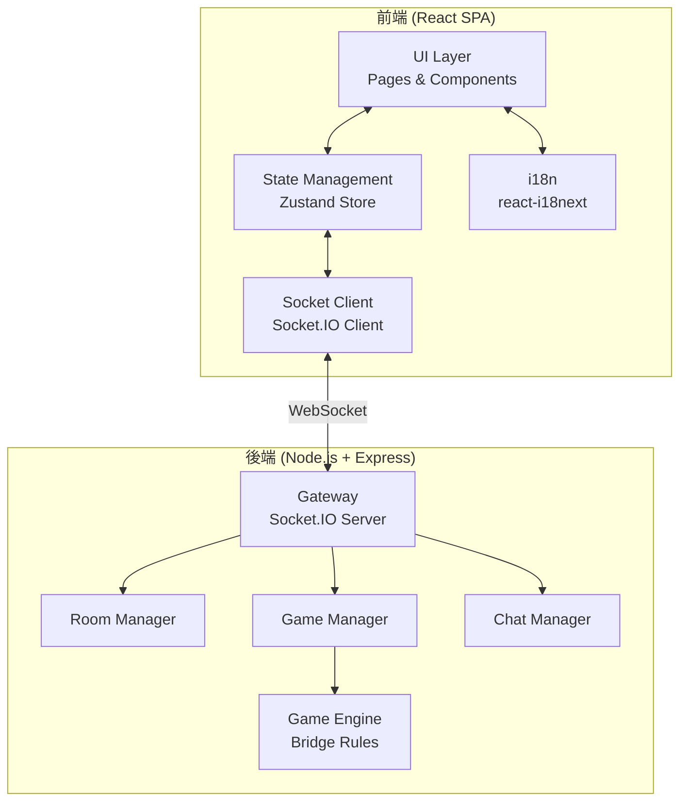
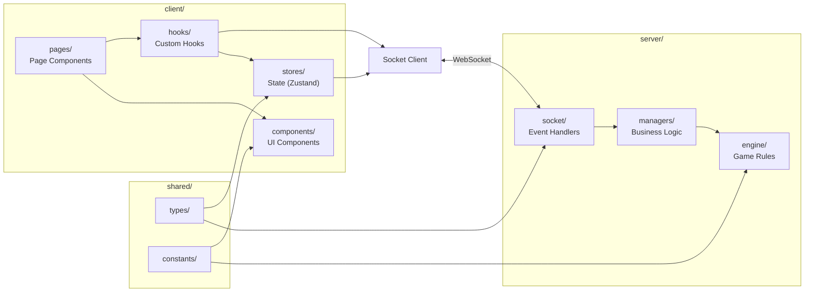
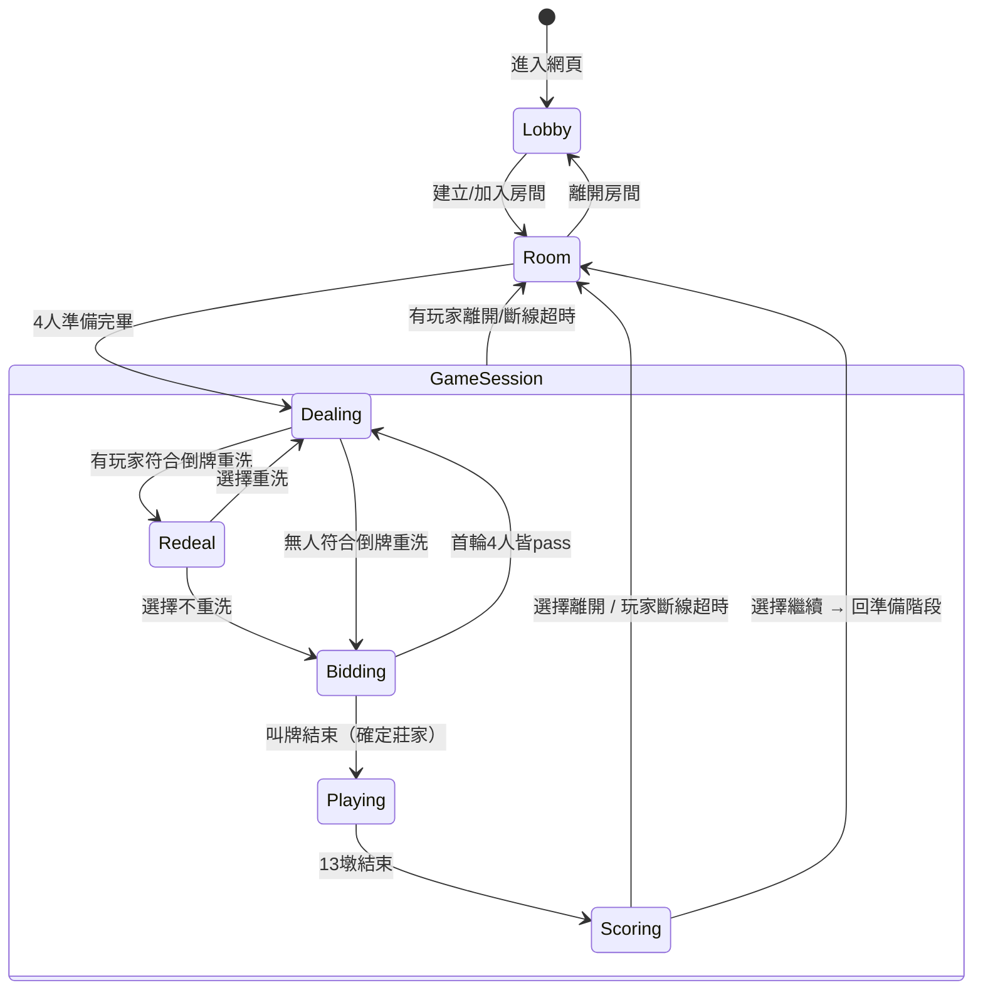
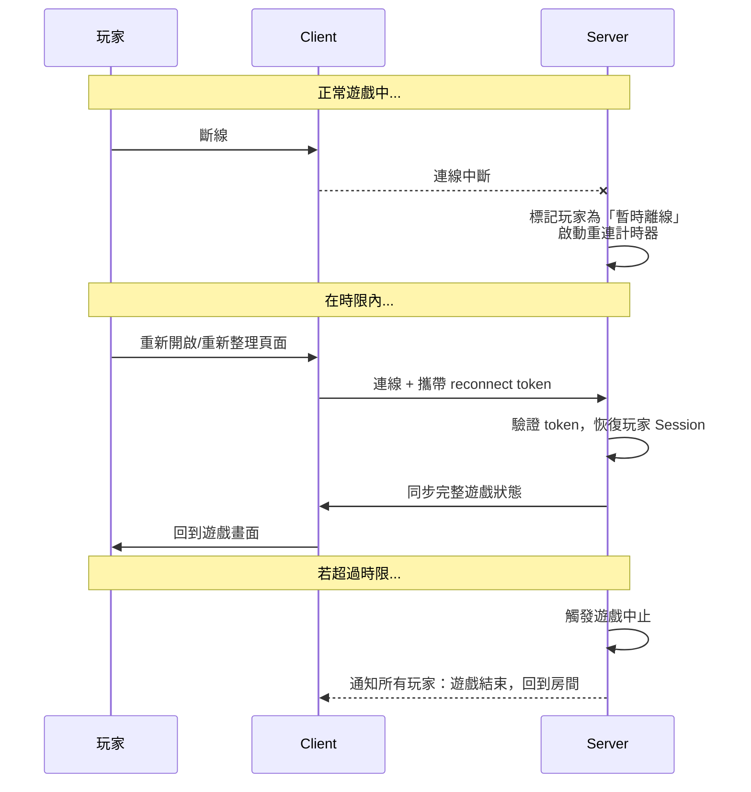

# Bridge Online — 工程計劃文件 (Proposal)

> **文件版本**: v1.0  
> **建立日期**: 2026-07-18  
> **輸入來源**: [agents.md](file:///c:/Users/ben91/Desktop/Bridge_Online/docs/agents.md)

---

## 1. 專案概述

Bridge Online 是一款線上橋牌 PvP 網頁遊戲。玩家透過瀏覽器進入遊戲，輸入暱稱後即可建立或加入房間，與其他玩家進行標準橋牌對局。

### 1.1 核心目標

- 提供流暢的線上多人即時橋牌遊戲體驗
- 支援房間制度、即時聊天、完整橋牌規則
- 前後端分離、可擴展的架構設計
- 中英文雙語介面 (i18n)

---

## 2. 需求總結

### 2.1 系統需求

| 編號 | 需求 | 說明 |
|------|------|------|
| S-01 | 暱稱輸入 | 進入遊戲後輸入暱稱，不得為空，長度上限 10 字 |
| S-02 | 顏色選擇 | 玩家可自行選擇代表顏色作為視覺識別 |
| S-03 | 房間系統 | 可建立新房間（指定遊戲類型）或輸入代碼加入房間 |
| S-04 | 座位系統 | 東西南北四個座位，玩家可自由更換 |
| S-05 | 聊天功能 | 進入房間後即可聊天，遊戲中持續可用 |
| S-06 | 準備機制 | 玩家選定座位後按準備，4 人皆準備即開始 |
| S-07 | 斷線重連 | 玩家斷線後可在一定時間內重新連線回到遊戲 |
| S-08 | 遊戲中離開 | 有玩家離開/斷線超時 → 放棄該局，所有玩家回到房間大廳 |

### 2.2 遊戲需求

| 編號 | 需求 | 說明 |
|------|------|------|
| G-01 | 發牌 | 52 張牌隨機發給 4 位玩家，每人 13 張，按花色及大小排序 |
| G-02 | 倒牌重洗 | 無 A 且總點數 ≤ 4 時可選擇重洗（影響所有人） |
| G-03 | 叫牌 | 隨機指定起始玩家，順時鐘輪流叫牌，支援圖形化叫牌介面 |
| G-04 | 叫牌規則 | 數字 1-7 + 花色 (梅花 < 方塊 < 紅心 < 黑桃 < NT)，須大於前叫或 pass |
| G-05 | 叫牌結束 | 連續 3 pass 結束叫牌（確定莊家）；首輪 4 pass 則重新發牌 |
| G-06 | 出牌 | 13 墩，每墩 4 張牌，莊家逆時鐘第一位先出，順時鐘進行 |
| G-07 | 跟牌規則 | 必須跟主花色，無主花色時可出其他花色 |
| G-08 | 王牌機制 | 莊家叫牌花色為王牌，NT 則無王牌 |
| G-09 | 墩數比較 | 王牌 > 主花色 > 其他；同花色比數字 |
| G-10 | 結算 | 東西為一方、南北為一方；莊家方墩數 ≥ (6 + 叫牌數) 即獲勝 |
| G-11 | 遊戲動作日誌 | 所有叫牌與出牌動作記錄在 log 欄，所有玩家可見 |
| G-12 | 續局/離開 | 遊戲結束後可選擇繼續（回到準備階段）或離開房間 |

### 2.3 非功能需求

| 編號 | 需求 | 說明 |
|------|------|------|
| NF-01 | 桌機瀏覽器 | 僅需支援桌機瀏覽器，不需響應式/手機版 |
| NF-02 | 無帳號系統 | 僅使用暱稱，無需註冊/登入 |
| NF-03 | 記憶體儲存 | 所有資料僅存於記憶體，伺服器重啟即清除 |
| NF-04 | 可擴展性 | 架構設計需考慮中等規模可擴展性 |
| NF-05 | i18n | 支援中文與英文雙語介面 |
| NF-06 | 核心邏輯測試 | 叫牌規則、出牌規則、結算邏輯需有單元測試 |

---

## 3. 技術選型

| 層級 | 技術 | 說明 |
|------|------|------|
| **前端框架** | React 18+ (Vite) | SPA 架構，快速開發與熱重載 |
| **前端語言** | TypeScript | 型別安全，提升可維護性 |
| **前端狀態管理** | Zustand | 輕量級、易於整合 Socket.IO 事件 |
| **前端 i18n** | react-i18next | 成熟的 React 多語系解決方案 |
| **前端樣式** | CSS Modules | 元件級樣式隔離，避免全域汙染 |
| **後端框架** | Node.js + Express | 成熟穩定，生態系豐富 |
| **後端語言** | TypeScript | 前後端型別共用 |
| **即時通訊** | Socket.IO | 封裝 WebSocket，自動重連、房間機制、fallback |
| **資料儲存** | 記憶體 (Map/Object) | 無需資料庫，伺服器重啟即清除 |
| **測試框架** | Vitest | 與 Vite 原生整合，支援 TypeScript |
| **建置工具** | Vite | 前端打包與開發伺服器 |
| **套件管理** | npm | 標準套件管理工具 |

---

## 4. 系統架構

### 4.1 高層架構圖



### 4.2 架構設計原則

1. **前後端分離**: 前端為純 SPA，後端為 API + WebSocket 服務
2. **事件驅動**: 所有即時互動透過 Socket.IO 事件進行
3. **遊戲邏輯後端化**: 所有遊戲規則判定在後端執行，前端僅負責顯示與輸入
4. **共用型別**: 前後端共用 TypeScript 型別定義（shared package）
5. **狀態同步**: 後端為權威狀態來源（Server-Authoritative），前端狀態為後端同步的投影

---

## 5. 元件劃分與職責

### 5.1 專案目錄結構

```
Bridge_Online/
├── docs/                          # 文件
│   ├── agents.md                  # 原始需求
│   └── proposal.md                # 本工程計劃
├── shared/                        # 前後端共用
│   └── src/
│       ├── types/                 # 共用型別定義
│       │   ├── room.ts            # 房間相關型別
│       │   ├── game.ts            # 遊戲相關型別
│       │   ├── player.ts          # 玩家相關型別
│       │   ├── chat.ts            # 聊天相關型別
│       │   └── socket-events.ts   # Socket 事件名稱與 payload 定義
│       └── constants/             # 共用常數
│           ├── cards.ts           # 牌組、花色、數字定義
│           └── game-rules.ts      # 遊戲規則常數
├── server/                        # 後端
│   ├── src/
│   │   ├── index.ts               # 進入點，啟動 Express + Socket.IO
│   │   ├── socket/                # Socket 事件處理
│   │   │   ├── connection.ts      # 連線/斷線處理
│   │   │   ├── room-handler.ts    # 房間相關事件
│   │   │   ├── game-handler.ts    # 遊戲相關事件
│   │   │   └── chat-handler.ts    # 聊天相關事件
│   │   ├── managers/              # 業務邏輯管理器
│   │   │   ├── room-manager.ts    # 房間生命週期管理
│   │   │   ├── game-manager.ts    # 遊戲流程管理
│   │   │   ├── player-manager.ts  # 玩家狀態管理
│   │   │   └── chat-manager.ts    # 聊天訊息管理
│   │   ├── engine/                # 遊戲引擎（純邏輯，無副作用）
│   │   │   ├── deck.ts            # 牌組生成與洗牌
│   │   │   ├── dealing.ts         # 發牌與倒牌重洗判定
│   │   │   ├── bidding.ts         # 叫牌規則引擎
│   │   │   ├── playing.ts         # 出牌規則引擎
│   │   │   └── scoring.ts         # 結算引擎
│   │   └── utils/                 # 工具函式
│   │       └── id-generator.ts    # 房間代碼等 ID 生成
│   └── tests/                     # 後端測試
│       └── engine/                # 遊戲引擎單元測試
│           ├── dealing.test.ts
│           ├── bidding.test.ts
│           ├── playing.test.ts
│           └── scoring.test.ts
└── client/                        # 前端
    ├── public/
    │   └── locales/               # i18n 翻譯檔
    │       ├── zh-TW/
    │       │   └── translation.json
    │       └── en/
    │           └── translation.json
    ├── src/
    │   ├── main.tsx               # React 進入點
    │   ├── App.tsx                # 根元件、路由
    │   ├── i18n.ts                # i18n 初始化
    │   ├── socket.ts              # Socket.IO client 初始化
    │   ├── stores/                # Zustand 狀態管理
    │   │   ├── player-store.ts    # 玩家自身狀態
    │   │   ├── room-store.ts      # 房間狀態
    │   │   ├── game-store.ts      # 遊戲狀態
    │   │   └── chat-store.ts      # 聊天狀態
    │   ├── pages/                 # 頁面元件
    │   │   ├── LobbyPage.tsx      # 大廳（暱稱輸入 + 房間選擇）
    │   │   ├── RoomPage.tsx       # 房間等待頁面（座位 + 準備）
    │   │   └── GamePage.tsx       # 遊戲主頁面
    │   ├── components/            # UI 元件
    │   │   ├── lobby/
    │   │   │   ├── NicknameForm.tsx
    │   │   │   ├── RoomJoinForm.tsx
    │   │   │   ├── RoomCreateForm.tsx
    │   │   │   └── ColorPicker.tsx
    │   │   ├── room/
    │   │   │   ├── SeatLayout.tsx
    │   │   │   ├── SeatSlot.tsx
    │   │   │   ├── PlayerInfo.tsx
    │   │   │   └── ReadyButton.tsx
    │   │   ├── game/
    │   │   │   ├── GameBoard.tsx        # 遊戲桌面主容器
    │   │   │   ├── HandCards.tsx        # 手牌區域
    │   │   │   ├── Card.tsx            # 單張牌元件
    │   │   │   ├── BiddingPanel.tsx     # 叫牌面板
    │   │   │   ├── BiddingButton.tsx    # 單個叫牌按鈕
    │   │   │   ├── TrickArea.tsx        # 當前墩牌桌
    │   │   │   ├── TrickCard.tsx        # 墩中已出的牌
    │   │   │   ├── GameInfo.tsx         # 遊戲資訊（莊家、王牌等）
    │   │   │   ├── ScoreBoard.tsx       # 結算畫面
    │   │   │   └── RedealPrompt.tsx     # 倒牌重洗提示
    │   │   ├── chat/
    │   │   │   ├── ChatPanel.tsx
    │   │   │   ├── ChatMessage.tsx
    │   │   │   └── ChatInput.tsx
    │   │   └── common/
    │   │       ├── ActionLog.tsx        # 遊戲動作日誌
    │   │       └── LanguageSwitch.tsx   # 語系切換
    │   ├── hooks/                 # 自訂 Hooks
    │   │   ├── useSocket.ts       # Socket 連線管理
    │   │   └── useGameState.ts    # 遊戲狀態便捷存取
    │   └── styles/                # 樣式
    │       ├── global.css         # 全域樣式 & CSS 變數
    │       ├── LobbyPage.module.css
    │       ├── RoomPage.module.css
    │       ├── GamePage.module.css
    │       └── components/        # 元件樣式
    └── vite.config.ts
```

### 5.2 元件關聯圖



### 5.3 各元件職責說明

#### 5.3.1 共用層 (shared/)

| 元件 | 職責 |
|------|------|
| `types/` | 定義前後端共用的 TypeScript 介面與型別（房間、遊戲、玩家、聊天、Socket 事件） |
| `constants/` | 定義撲克牌花色、數字、遊戲規則等常數 |

#### 5.3.2 後端 (server/)

| 元件 | 職責 |
|------|------|
| `socket/connection` | 處理 Socket 連線/斷線、斷線重連邏輯 |
| `socket/room-handler` | 處理房間相關 Socket 事件（創建、加入、換座位、準備） |
| `socket/game-handler` | 處理遊戲相關 Socket 事件（叫牌、出牌、倒牌重洗選擇） |
| `socket/chat-handler` | 處理聊天相關 Socket 事件 |
| `managers/room-manager` | 房間 CRUD、座位管理、準備狀態管理、房間生命週期 |
| `managers/game-manager` | 遊戲流程狀態機（發牌→叫牌→出牌→結算）、呼叫 Engine 進行規則判定 |
| `managers/player-manager` | 玩家 Session 管理、斷線重連映射 |
| `managers/chat-manager` | 聊天訊息管理（房間級別） |
| `engine/deck` | 牌組生成（52 張）、洗牌（Fisher-Yates） |
| `engine/dealing` | 發牌邏輯、手牌排序、倒牌重洗資格判定 |
| `engine/bidding` | 叫牌合法性驗證、叫牌流程判定（結束條件、莊家決定） |
| `engine/playing` | 出牌合法性驗證（跟牌規則）、墩贏家判定 |
| `engine/scoring` | 結算計算（莊家方墩數 vs. 合約墩數） |

#### 5.3.3 前端 (client/)

| 元件 | 職責 |
|------|------|
| `LobbyPage` | 大廳頁面：暱稱輸入、顏色選擇、房間建立/加入 |
| `RoomPage` | 房間頁面：座位佈局、玩家資訊、準備按鈕、聊天 |
| `GamePage` | 遊戲頁面：遊戲桌面、手牌、叫牌面板、出牌、聊天、日誌 |
| `stores/` | 前端狀態管理，接收 Socket 事件更新狀態，驅動 UI 重繪 |
| `hooks/` | 封裝 Socket 連線管理與遊戲狀態存取邏輯 |

---

## 6. 核心流程設計

### 6.1 遊戲狀態機



### 6.2 斷線重連流程



### 6.3 Socket 事件設計（概要）

#### Client → Server

| 事件 | Payload | 說明 |
|------|---------|------|
| `player:setNickname` | `{ nickname, color }` | 設定暱稱與顏色 |
| `room:create` | `{ gameType }` | 建立房間 |
| `room:join` | `{ roomCode }` | 加入房間 |
| `room:leave` | — | 離開房間 |
| `room:changeSeat` | `{ seat }` | 更換座位 (N/E/S/W) |
| `room:ready` | — | 按下準備 |
| `room:unready` | — | 取消準備 |
| `game:redealResponse` | `{ accept }` | 回應倒牌重洗 |
| `game:bid` | `{ bid }` | 叫牌 |
| `game:playCard` | `{ card }` | 出牌 |
| `game:continue` | — | 繼續下一局 |
| `chat:send` | `{ message }` | 發送聊天訊息 |
| `player:reconnect` | `{ token }` | 嘗試重連 |

#### Server → Client

| 事件 | Payload | 說明 |
|------|---------|------|
| `room:created` | `{ roomCode, room }` | 房間建立成功 |
| `room:joined` | `{ room }` | 加入房間成功 |
| `room:updated` | `{ room }` | 房間狀態更新（座位、準備等） |
| `room:playerLeft` | `{ playerId }` | 有玩家離開 |
| `game:started` | `{ gameState }` | 遊戲開始 |
| `game:dealt` | `{ hand }` | 發牌結果（僅自己的手牌） |
| `game:redealAvailable` | — | 通知可倒牌重洗 |
| `game:redealt` | `{ hand }` | 重洗後的新手牌 |
| `game:biddingStart` | `{ startPlayer }` | 叫牌階段開始 |
| `game:bidMade` | `{ player, bid }` | 某玩家叫牌 |
| `game:biddingEnd` | `{ declarer, contract }` | 叫牌結束 |
| `game:turnStart` | `{ player, validCards }` | 輪到某玩家出牌 |
| `game:cardPlayed` | `{ player, card }` | 某玩家出牌 |
| `game:trickEnd` | `{ winner, trickCards }` | 一墩結束 |
| `game:ended` | `{ result }` | 遊戲結束結算 |
| `game:aborted` | `{ reason }` | 遊戲中止 |
| `chat:received` | `{ message }` | 收到聊天訊息 |
| `player:reconnected` | `{ gameState }` | 重連成功，同步狀態 |
| `error` | `{ code, message }` | 錯誤訊息 |

---

## 7. 開發階段規劃

### Phase 0：專案初始化

- 初始化 monorepo 結構（shared / server / client）
- 設定 TypeScript、ESLint、Prettier
- 設定 Vite (client) + ts-node/tsx (server)
- 建立 shared 型別定義
- 建立基本開發腳本 (`dev`, `build`, `test`)

### Phase 1：系統基礎（大廳 + 房間）

- **後端**: Socket 連線管理、Player Manager、Room Manager
- **前端**: LobbyPage（暱稱 + 顏色 + 房間操作）、RoomPage（座位 + 準備）
- **驗收**: 多個瀏覽器分頁可建立/加入房間、選擇座位、按下準備

### Phase 2：聊天功能

- **後端**: Chat Manager
- **前端**: ChatPanel、ChatMessage、ChatInput
- **驗收**: 房間內玩家可即時聊天

### Phase 3：遊戲引擎 — 發牌與叫牌

- **後端**: Deck、Dealing（含倒牌重洗）、Bidding 引擎
- **前端**: GameBoard、HandCards、Card、BiddingPanel、RedealPrompt
- **測試**: dealing.test.ts、bidding.test.ts
- **驗收**: 可完成從發牌到叫牌結束的完整流程

### Phase 4：遊戲引擎 — 出牌與結算

- **後端**: Playing 引擎、Scoring 引擎、Game Manager 完整流程
- **前端**: TrickArea、TrickCard、GameInfo、ScoreBoard、ActionLog
- **測試**: playing.test.ts、scoring.test.ts
- **驗收**: 可完成一整局橋牌遊戲

### Phase 5：斷線重連

- **後端**: 斷線偵測、重連 token、狀態恢復
- **前端**: 重連 UI 提示、狀態同步
- **驗收**: 斷線後重新整理瀏覽器可回到遊戲

### Phase 6：i18n 多語系

- **前端**: react-i18next 設定、中英文翻譯檔、語系切換 UI
- **驗收**: 所有介面文字可切換中英文

### Phase 7：視覺打磨與整合測試

- UI 動畫與過渡效果
- 出牌/叫牌互動優化
- 整體視覺風格一致性調整
- 端對端場景測試

---

## 8. 關鍵設計決策摘要

| 決策項目 | 選擇 | 理由 |
|----------|------|------|
| 遊戲邏輯位置 | Server-Authoritative | 防作弊，確保遊戲公平性 |
| 狀態管理 | Zustand | 輕量、TypeScript 友好，易與 Socket 事件整合 |
| 遊戲引擎獨立 | engine/ 為純函式模組 | 無副作用，便於單元測試 |
| Socket.IO | 而非原生 WebSocket | 自動重連、房間機制、fallback 支援 |
| Monorepo 結構 | shared/ 共用型別 | 前後端型別一致，減少同步問題 |
| CSS Modules | 而非 Tailwind/CSS-in-JS | 效能好、無額外依賴、與 Vite 原生整合 |
| 斷線恢復 | Token-based reconnect | 簡單可靠，無需持久化 Session |
