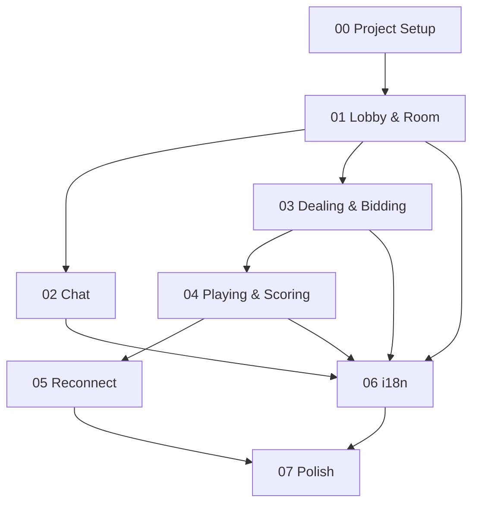

# Bridge Online — 工程進度總覽

> **最後更新**: 2026-07-18

---

## 依賴關係圖

> **可並行開發**：`02 Chat` 與 `03 Dealing & Bidding` 可在 `01` 完成後同時開始；`06 i18n` 可與 `05 Reconnect` 並行。

---

## Component 進度

- [ ] [00 — Project Setup](./00-project-setup.md)
- [ ] [01 — Lobby & Room System](./01-lobby-room.md)
- [ ] [02 — Chat System](./02-chat.md)
- [ ] [03 — Game Engine: Dealing & Bidding](./03-game-dealing-bidding.md)
- [ ] [04 — Game Engine: Playing & Scoring](./04-game-playing-scoring.md)
- [ ] [05 — Disconnect & Reconnect](./05-reconnect.md)
- [ ] [06 — i18n 多語系](./06-i18n.md)
- [ ] [07 — Visual Polish & Integration Testing](./07-polish.md)

---

## 任務統計

| Component | 子任務數 | 完成數 | 進度 |
|-----------|---------|--------|------|
| 00 Project Setup | 60 | 0 | 0% |
| 01 Lobby & Room | 52 | 0 | 0% |
| 02 Chat | 16 | 0 | 0% |
| 03 Dealing & Bidding | 60 | 0 | 0% |
| 04 Playing & Scoring | 40 | 0 | 0% |
| 05 Reconnect | 19 | 0 | 0% |
| 06 i18n | 17 | 0 | 0% |
| 07 Polish | 30 | 0 | 0% |
| **合計** | **294** | **0** | **0%** |

---

## 建議開發順序

1. **Phase 0** — Project Setup（基礎設施）
2. **Phase 1** — Lobby & Room（核心系統骨架）
3. **Phase 2 + 3**（並行）— Chat + Dealing & Bidding
4. **Phase 4** — Playing & Scoring（完整遊戲流程）
5. **Phase 5 + 6**（並行）— Reconnect + i18n
6. **Phase 7** — Polish（最終打磨）
