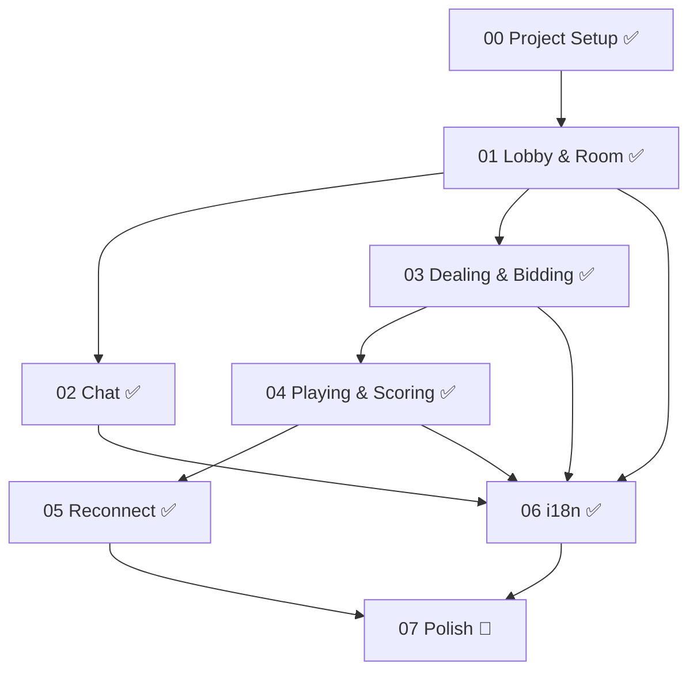

# Bridge Online — 工程進度總覽

> **最後更新**: 2026-07-26

---

## 依賴關係圖

---

## Component 進度

- [x] [00 — Project Setup](./00-project-setup.md)
- [x] [01 — Lobby & Room System](./01-lobby-room.md)
- [x] [02 — Chat System](./02-chat.md)
- [x] [03 — Game Engine: Dealing & Bidding](./03-game-dealing-bidding.md)
- [x] [04 — Game Engine: Playing & Scoring](./04-game-playing-scoring.md)
- [x] [05 — Disconnect & Reconnect](./05-reconnect.md)
- [x] [06 — i18n 多語系](./06-i18n.md)
- [ ] [07 — Visual Polish & Integration Testing](./07-polish.md)

---

## 任務統計

| Component | 子任務數 | 完成數 | 進度 |
|-----------|---------|--------|------|
| 00 Project Setup | 60 | 60 | 100% |
| 01 Lobby & Room | 52 | 52 | 100% |
| 02 Chat | 16 | 16 | 100% |
| 03 Dealing & Bidding | 60 | 60 | 100% |
| 04 Playing & Scoring | 40 | 40 | 100% |
| 05 Reconnect | 19 | 19 | 100% |
| 06 i18n | 17 | 17 | 100% |
| 07 Polish | 30 | 0 | 0% |
| **合計** | **294** | **264** | **90%** |

---

## 測試統計

| 測試檔案 | 測試數量 | 狀態 |
|---------|---------|------|
| `deck.test.ts` | 9 | ✅ |
| `dealing.test.ts` | 12 | ✅ |
| `bidding.test.ts` | 20 | ✅ |
| `playing.test.ts` | 18 | ✅ |
| `scoring.test.ts` | 7 | ✅ |
| **合計** | **66** | **全部通過** |
